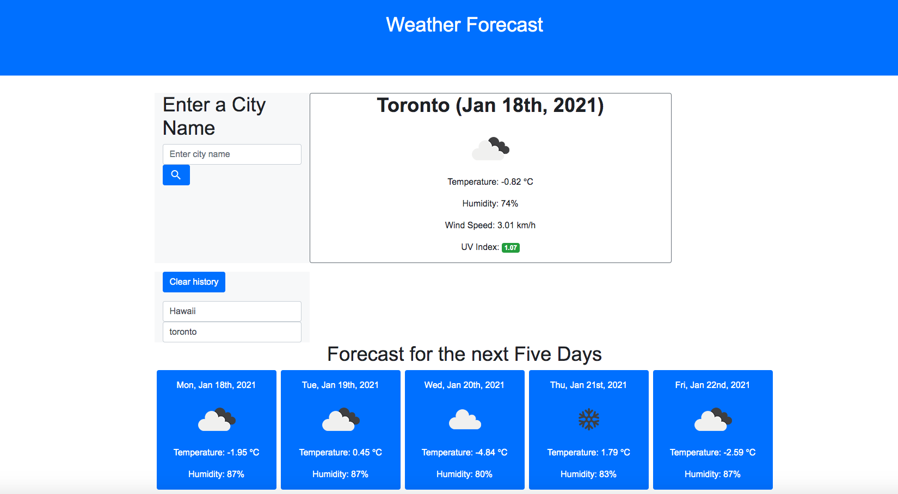

# week-6-challenge
My solution to week 6 challenge; Weather Dashboard.
This webpage displays a channel: to input a city's name to obtain weather forecasts on the dashboard.

When the user inputs the city's name correctly; the user is presented with current and future conditions for that city and that city is added to the search history.

When the user views current weather conditions for that city; user is presented with the city name, the date, an icon representation of weather conditions, the temperature, the humidity, the wind speed, and the UV index.

When the user views the UV index; the user is presented with a color that indicates whether the conditions are favorable, moderate, or severe.

When the user views future weather conditions for that city; the user is presented with a 5-day forecast that displays the date, an icon representation of weather conditions, the temperature, and the humidity.

When the user clicks on a city in the search history; the user is again presented with current and future conditions for that city.

Deployed URL: https://ojashri-basnyat.github.io/week-6-challenge/

